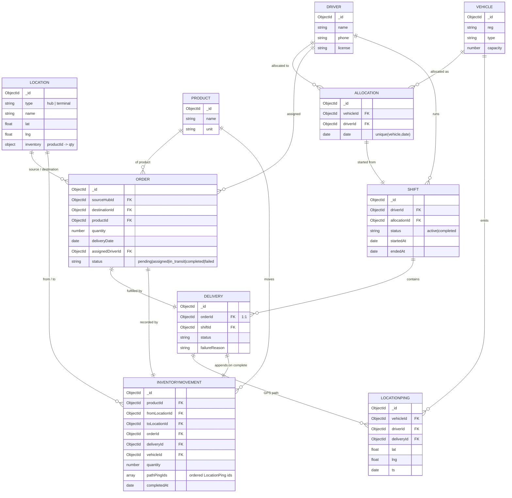
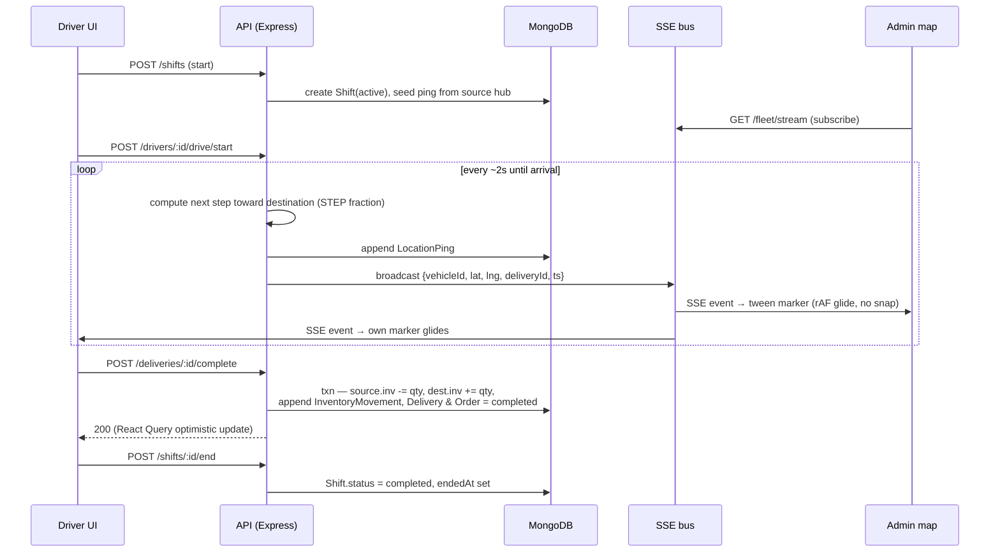

# Fleet Tracking Platform — Backend Data Model & Core Flow

> Companion to [01-FRD.md](01-FRD.md). Reconstructed from FRD §4 (entities), §6 (live-tracking +
> inventory simulation), and §8 (key decisions). **Implemented in `fp-server/`** — the ten Mongoose
> models in `fp-server/src/models/` follow this schema. Diagrams below render on GitHub (Mermaid). The
> hand-drawn SVG versions live in [diagrams/](diagrams/).

## 1. Entity-Relationship (data model)

Ten Mongoose collections grouped by role:

- **Master data** — `Location` (hub *or* terminal), `Product`, `Driver`, `Vehicle`
- **Operations** — `Allocation`, `Order`
- **Shift / delivery** — `Shift`, `Delivery`
- **Tracking / ledger** — `LocationPing` (GPS history), `InventoryMovement` (append-only ledger)

**Key relationships & decisions** (FRD §8):

- `Allocation` binds `Vehicle` + `Driver` + `date`, with a **unique constraint on (vehicle, date)** —
  the mechanism behind the double-booking 409 (FR-VA-3).
- `Order` carries the added `sourceHubId` (decision §8.2) alongside `destinationId`, so completion can
  move inventory hub → terminal.
- `Delivery` is **1:1 with `Order`** (v1) and belongs to a `Shift`.
- `LocationPing` is the raw GPS history — one row per simulated step.
- `InventoryMovement` is the **append-only ledger** written once per completed delivery; it stores
  `pathPingIds[]` so any past trip's route (FR-MV-2) is reconstructable. Cached `Location.inventory`
  balances stay derivable from this ledger.

## 2. Core flow — live-tracking + delivery completion (sequence)

The headline loop (FRD §6): a driver's simulated GPS step is persisted, broadcast over an in-process
SSE bus, and glided onto the admin map within ~1s.

**Notes:**

1. **GPS is deterministic** — each step advances a fixed fraction `STEP` of the remaining great-circle
   vector toward the destination, clamped on arrival. Never random jitter.
2. **Two trigger modes** — manual `POST /drivers/:id/gps` (one step) and auto-drive
   `POST /drivers/:id/drive/start` (server timer, ~2s cadence, `…/drive/stop` to halt).
3. **Real-time = SSE push** via an in-process `EventEmitter` pub/sub — no broker. Clients tween markers
   with `requestAnimationFrame` for continuous motion. The 30s reconcile poll + manual refresh exist
   only as a reconnect fallback.
4. **Completion is one transaction** — inventory move + immutable `InventoryMovement` append happen
   atomically; negative stock is blocked with an error. Failed deliveries write no movement.
